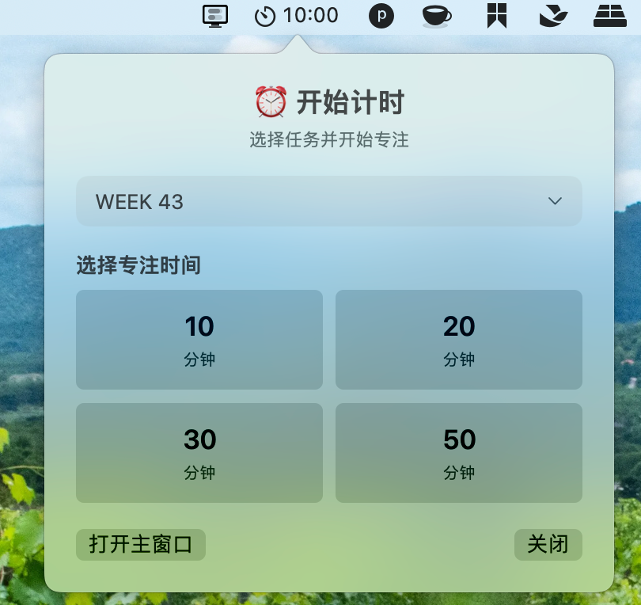
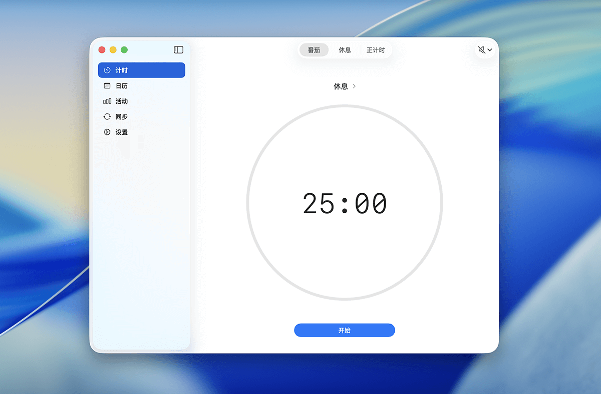
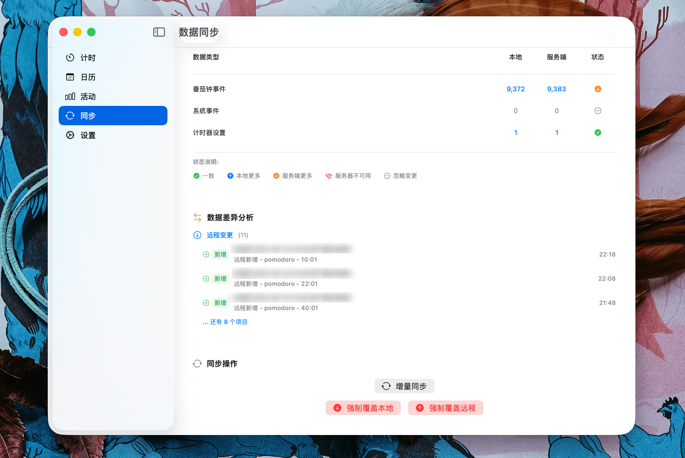
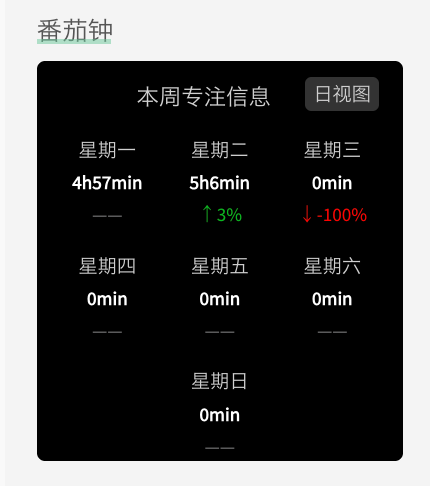
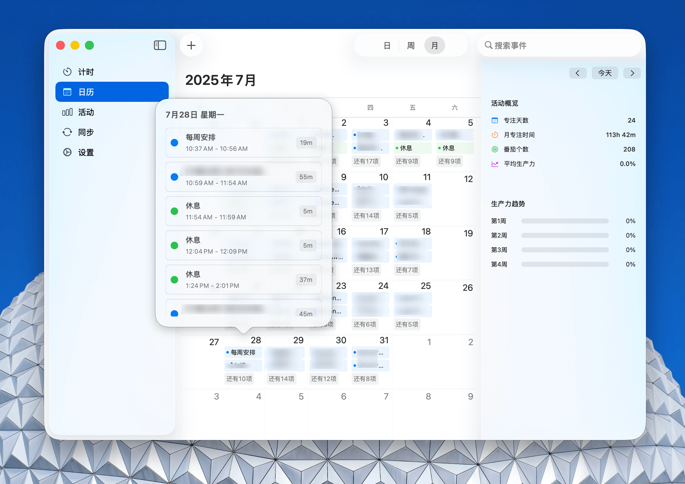

# LifeTimer for macOS专注工作，享受生活 😎

## 功能特性

### Tray 快捷入口



### 丰富快捷键
- `ctrl + space` 唤起mini 弹窗
- `+` / `-` 在专注过程中快速调整时间
- `空格`：暂停/继续 专注

### 简洁的界面设计


### 数据云同步


### 数据小组件


### 日/周/月视图


### 更多细节 💡
更多细节等你发现！

## 编译方式
- 确保安装了最新版本的 Xcode
- 打开项目文件夹，选择 `File` -> `Open`
- 选择 `LifeTimer.xcodeproj` 文件
- 点击 `Product` -> `Build` 编译项目

## 服务端部署


- 上传到服务器
下载 https://github.com/ihewro/LifeTimer ，将 sync_server 文件夹打包上传到服务器。目录需要递归给755权限（www 可读可写）

- 伪静态
```php
if (!-e $request_filename) {
        rewrite ^(.*)$ /index.php$1 last;
    }
```
测试接口：https://sync.ihewro.com/api/health ,显示json数据即为正常